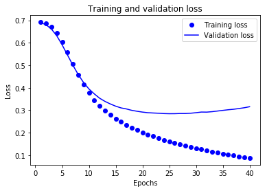
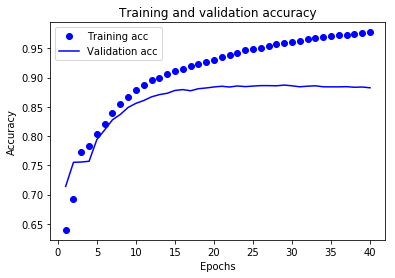

```python
import tensorflow as tf
from tensorflow import keras

import numpy as np

print(tf.__version__)
```

    1.12.0
    


```python
imdb = keras.datasets.imdb

(train_data, train_labels), (test_data, test_labels) = imdb.load_data(num_words=10000)
```

    Downloading data from https://storage.googleapis.com/tensorflow/tf-keras-datasets/imdb.npz
    17465344/17464789 [==============================] - 2s 0us/step
    


```python
print("Training entries: {}, labels: {}".format(len(train_data), len(train_labels)))
```

    Training entries: 25000, labels: 25000
    


```python
print(train_data[0])
```

    [1, 14, 22, 16, 43, 530, 973, 1622, 1385, 65, 458, 4468, 66, 3941, 4, 173, 36, 256, 5, 25, 100, 43, 838, 112, 50, 670, 2, 9, 35, 480, 284, 5, 150, 4, 172, 112, 167, 2, 336, 385, 39, 4, 172, 4536, 1111, 17, 546, 38, 13, 447, 4, 192, 50, 16, 6, 147, 2025, 19, 14, 22, 4, 1920, 4613, 469, 4, 22, 71, 87, 12, 16, 43, 530, 38, 76, 15, 13, 1247, 4, 22, 17, 515, 17, 12, 16, 626, 18, 2, 5, 62, 386, 12, 8, 316, 8, 106, 5, 4, 2223, 5244, 16, 480, 66, 3785, 33, 4, 130, 12, 16, 38, 619, 5, 25, 124, 51, 36, 135, 48, 25, 1415, 33, 6, 22, 12, 215, 28, 77, 52, 5, 14, 407, 16, 82, 2, 8, 4, 107, 117, 5952, 15, 256, 4, 2, 7, 3766, 5, 723, 36, 71, 43, 530, 476, 26, 400, 317, 46, 7, 4, 2, 1029, 13, 104, 88, 4, 381, 15, 297, 98, 32, 2071, 56, 26, 141, 6, 194, 7486, 18, 4, 226, 22, 21, 134, 476, 26, 480, 5, 144, 30, 5535, 18, 51, 36, 28, 224, 92, 25, 104, 4, 226, 65, 16, 38, 1334, 88, 12, 16, 283, 5, 16, 4472, 113, 103, 32, 15, 16, 5345, 19, 178, 32]
    


```python
len(train_data[0]), len(train_data[1])
```


    (218, 189)


```python
# A dictionary mapping words to an integer index
word_index = imdb.get_word_index()

# The first indices are reserved
word_index = {k:(v+3) for k,v in word_index.items()}
word_index["<PAD>"] = 0
word_index["<START>"] = 1
word_index["<UNK>"] = 2  # unknown
word_index["<UNUSED>"] = 3

reverse_word_index = dict([(value, key) for (key, value) in word_index.items()])

def decode_review(text):
    return ' '.join([reverse_word_index.get(i, '?') for i in text])
```

    Downloading data from https://storage.googleapis.com/tensorflow/tf-keras-datasets/imdb_word_index.json
    1646592/1641221 [==============================] - 0s 0us/step
    


```python
decode_review(train_data[0])
```


    "<START> this film was just brilliant casting location scenery story direction everyone's really suited the part they played and you could just imagine being there robert <UNK> is an amazing actor and now the same being director <UNK> father came from the same scottish island as myself so i loved the fact there was a real connection with this film the witty remarks throughout the film were great it was just brilliant so much that i bought the film as soon as it was released for <UNK> and would recommend it to everyone to watch and the fly fishing was amazing really cried at the end it was so sad and you know what they say if you cry at a film it must have been good and this definitely was also <UNK> to the two little boy's that played the <UNK> of norman and paul they were just brilliant children are often left out of the <UNK> list i think because the stars that play them all grown up are such a big profile for the whole film but these children are amazing and should be praised for what they have done don't you think the whole story was so lovely because it was true and was someone's life after all that was shared with us all"


```python
train_data = keras.preprocessing.sequence.pad_sequences(train_data,
                                                        value=word_index["<PAD>"],
                                                        padding='post',
                                                        maxlen=256)

test_data = keras.preprocessing.sequence.pad_sequences(test_data,
                                                       value=word_index["<PAD>"],
                                                       padding='post',
                                                       maxlen=256)
```


```python
len(train_data[0]), len(train_data[1])
```


    (256, 256)


```python
print(train_data[0])
```

    [   1   14   22   16   43  530  973 1622 1385   65  458 4468   66 3941
        4  173   36  256    5   25  100   43  838  112   50  670    2    9
       35  480  284    5  150    4  172  112  167    2  336  385   39    4
      172 4536 1111   17  546   38   13  447    4  192   50   16    6  147
     2025   19   14   22    4 1920 4613  469    4   22   71   87   12   16
       43  530   38   76   15   13 1247    4   22   17  515   17   12   16
      626   18    2    5   62  386   12    8  316    8  106    5    4 2223
     5244   16  480   66 3785   33    4  130   12   16   38  619    5   25
      124   51   36  135   48   25 1415   33    6   22   12  215   28   77
       52    5   14  407   16   82    2    8    4  107  117 5952   15  256
        4    2    7 3766    5  723   36   71   43  530  476   26  400  317
       46    7    4    2 1029   13  104   88    4  381   15  297   98   32
     2071   56   26  141    6  194 7486   18    4  226   22   21  134  476
       26  480    5  144   30 5535   18   51   36   28  224   92   25  104
        4  226   65   16   38 1334   88   12   16  283    5   16 4472  113
      103   32   15   16 5345   19  178   32    0    0    0    0    0    0
        0    0    0    0    0    0    0    0    0    0    0    0    0    0
        0    0    0    0    0    0    0    0    0    0    0    0    0    0
        0    0    0    0]
    


```python
# input shape is the vocabulary count used for the movie reviews (10,000 words)
vocab_size = 10000

model = keras.Sequential()
model.add(keras.layers.Embedding(vocab_size, 16))
model.add(keras.layers.GlobalAveragePooling1D())
model.add(keras.layers.Dense(16, activation=tf.nn.relu))
model.add(keras.layers.Dense(1, activation=tf.nn.sigmoid))

model.summary()
```

    _________________________________________________________________
    Layer (type)                 Output Shape              Param #   
    =================================================================
    embedding (Embedding)        (None, None, 16)          160000    
    _________________________________________________________________
    global_average_pooling1d (Gl (None, 16)                0         
    _________________________________________________________________
    dense (Dense)                (None, 16)                272       
    _________________________________________________________________
    dense_1 (Dense)              (None, 1)                 17        
    =================================================================
    Total params: 160,289
    Trainable params: 160,289
    Non-trainable params: 0
    _________________________________________________________________
    


```python
model.compile(optimizer=tf.train.AdamOptimizer(),
              loss='binary_crossentropy',
              metrics=['accuracy'])
```


```python
x_val = train_data[:10000]
partial_x_train = train_data[10000:]

y_val = train_labels[:10000]
partial_y_train = train_labels[10000:]
```


```python
history = model.fit(partial_x_train,
                    partial_y_train,
                    epochs=40,
                    batch_size=512,
                    validation_data=(x_val, y_val),
                    verbose=1)
```

    Train on 15000 samples, validate on 10000 samples
    Epoch 1/40
    15000/15000 [==============================] - 9s 622us/step - loss: 0.6918 - acc: 0.6397 - val_loss: 0.6898 - val_acc: 0.7141
    Epoch 2/40
    15000/15000 [==============================] - 2s 140us/step - loss: 0.6854 - acc: 0.6933 - val_loss: 0.6802 - val_acc: 0.7552
    Epoch 3/40
    15000/15000 [==============================] - 2s 152us/step - loss: 0.6703 - acc: 0.7735 - val_loss: 0.6611 - val_acc: 0.7557
    Epoch 4/40
    15000/15000 [==============================] - 2s 129us/step - loss: 0.6436 - acc: 0.7826 - val_loss: 0.6312 - val_acc: 0.7570
    Epoch 5/40
    15000/15000 [==============================] - 1s 94us/step - loss: 0.6048 - acc: 0.8029 - val_loss: 0.5909 - val_acc: 0.7942
    Epoch 6/40
    15000/15000 [==============================] - 1s 97us/step - loss: 0.5574 - acc: 0.8209 - val_loss: 0.5458 - val_acc: 0.8107
    Epoch 7/40
    15000/15000 [==============================] - 1s 92us/step - loss: 0.5065 - acc: 0.8401 - val_loss: 0.5007 - val_acc: 0.8279
    Epoch 8/40
    15000/15000 [==============================] - 2s 130us/step - loss: 0.4583 - acc: 0.8541 - val_loss: 0.4591 - val_acc: 0.8370
    Epoch 9/40
    15000/15000 [==============================] - 2s 114us/step - loss: 0.4141 - acc: 0.8675 - val_loss: 0.4234 - val_acc: 0.8490
    Epoch 10/40
    15000/15000 [==============================] - 2s 104us/step - loss: 0.3768 - acc: 0.8791 - val_loss: 0.3948 - val_acc: 0.8560
    Epoch 11/40
    15000/15000 [==============================] - 2s 100us/step - loss: 0.3454 - acc: 0.8875 - val_loss: 0.3730 - val_acc: 0.8608
    Epoch 12/40
    15000/15000 [==============================] - 1s 94us/step - loss: 0.3198 - acc: 0.8955 - val_loss: 0.3536 - val_acc: 0.8671
    Epoch 13/40
    15000/15000 [==============================] - 1s 89us/step - loss: 0.2979 - acc: 0.9001 - val_loss: 0.3394 - val_acc: 0.8709
    Epoch 14/40
    15000/15000 [==============================] - 2s 118us/step - loss: 0.2791 - acc: 0.9055 - val_loss: 0.3280 - val_acc: 0.8732
    Epoch 15/40
    15000/15000 [==============================] - 1s 95us/step - loss: 0.2625 - acc: 0.9105 - val_loss: 0.3181 - val_acc: 0.8780
    Epoch 16/40
    15000/15000 [==============================] - 1s 81us/step - loss: 0.2481 - acc: 0.9155 - val_loss: 0.3104 - val_acc: 0.8795
    Epoch 17/40
    15000/15000 [==============================] - 1s 88us/step - loss: 0.2354 - acc: 0.9192 - val_loss: 0.3059 - val_acc: 0.8775
    Epoch 18/40
    15000/15000 [==============================] - 1s 87us/step - loss: 0.2230 - acc: 0.9235 - val_loss: 0.2996 - val_acc: 0.8810
    Epoch 19/40
    15000/15000 [==============================] - 2s 120us/step - loss: 0.2126 - acc: 0.9272 - val_loss: 0.2955 - val_acc: 0.8823
    Epoch 20/40
    15000/15000 [==============================] - 1s 87us/step - loss: 0.2021 - acc: 0.9303 - val_loss: 0.2918 - val_acc: 0.8840
    Epoch 21/40
    15000/15000 [==============================] - 1s 89us/step - loss: 0.1927 - acc: 0.9350 - val_loss: 0.2891 - val_acc: 0.8852
    Epoch 22/40
    15000/15000 [==============================] - 1s 89us/step - loss: 0.1841 - acc: 0.9386 - val_loss: 0.2878 - val_acc: 0.8839
    Epoch 23/40
    15000/15000 [==============================] - 1s 87us/step - loss: 0.1761 - acc: 0.9420 - val_loss: 0.2867 - val_acc: 0.8857
    Epoch 24/40
    15000/15000 [==============================] - 1s 90us/step - loss: 0.1685 - acc: 0.9465 - val_loss: 0.2853 - val_acc: 0.8846
    Epoch 25/40
    15000/15000 [==============================] - 2s 115us/step - loss: 0.1613 - acc: 0.9487 - val_loss: 0.2846 - val_acc: 0.8855
    Epoch 26/40
    15000/15000 [==============================] - 2s 106us/step - loss: 0.1547 - acc: 0.9514 - val_loss: 0.2848 - val_acc: 0.8863
    Epoch 27/40
    15000/15000 [==============================] - 1s 81us/step - loss: 0.1480 - acc: 0.9543 - val_loss: 0.2856 - val_acc: 0.8863
    Epoch 28/40
    15000/15000 [==============================] - 1s 86us/step - loss: 0.1421 - acc: 0.9567 - val_loss: 0.2855 - val_acc: 0.8860
    Epoch 29/40
    15000/15000 [==============================] - 1s 84us/step - loss: 0.1361 - acc: 0.9596 - val_loss: 0.2868 - val_acc: 0.8872
    Epoch 30/40
    15000/15000 [==============================] - 1s 97us/step - loss: 0.1309 - acc: 0.9609 - val_loss: 0.2891 - val_acc: 0.8860
    Epoch 31/40
    15000/15000 [==============================] - 2s 111us/step - loss: 0.1258 - acc: 0.9631 - val_loss: 0.2920 - val_acc: 0.8843
    Epoch 32/40
    15000/15000 [==============================] - 1s 88us/step - loss: 0.1208 - acc: 0.9655 - val_loss: 0.2917 - val_acc: 0.8853
    Epoch 33/40
    15000/15000 [==============================] - 1s 84us/step - loss: 0.1160 - acc: 0.9684 - val_loss: 0.2937 - val_acc: 0.8860
    Epoch 34/40
    15000/15000 [==============================] - 1s 90us/step - loss: 0.1113 - acc: 0.9699 - val_loss: 0.2965 - val_acc: 0.8843
    Epoch 35/40
    15000/15000 [==============================] - 1s 87us/step - loss: 0.1069 - acc: 0.9711 - val_loss: 0.2994 - val_acc: 0.8842
    Epoch 36/40
    15000/15000 [==============================] - 1s 81us/step - loss: 0.1028 - acc: 0.9725 - val_loss: 0.3022 - val_acc: 0.8842
    Epoch 37/40
    15000/15000 [==============================] - 1s 87us/step - loss: 0.0994 - acc: 0.9735 - val_loss: 0.3044 - val_acc: 0.8845
    Epoch 38/40
    15000/15000 [==============================] - 1s 87us/step - loss: 0.0948 - acc: 0.9753 - val_loss: 0.3076 - val_acc: 0.8835
    Epoch 39/40
    15000/15000 [==============================] - 1s 83us/step - loss: 0.0911 - acc: 0.9766 - val_loss: 0.3112 - val_acc: 0.8839
    Epoch 40/40
    15000/15000 [==============================] - 1s 87us/step - loss: 0.0878 - acc: 0.9775 - val_loss: 0.3158 - val_acc: 0.8826
    


```python
results = model.evaluate(test_data, test_labels)

print(results)
```

    25000/25000 [==============================] - 4s 144us/step
    [0.3395507445144653, 0.86964]
    


```python
history_dict = history.history
history_dict.keys()
```


    dict_keys(['val_loss', 'val_acc', 'loss', 'acc'])


```python
import matplotlib.pyplot as plt

acc = history.history['acc']
val_acc = history.history['val_acc']
loss = history.history['loss']
val_loss = history.history['val_loss']

epochs = range(1, len(acc) + 1)

# "bo" is for "blue dot"
plt.plot(epochs, loss, 'bo', label='Training loss')
# b is for "solid blue line"
plt.plot(epochs, val_loss, 'b', label='Validation loss')
plt.title('Training and validation loss')
plt.xlabel('Epochs')
plt.ylabel('Loss')
plt.legend()

plt.show()
```





```python
plt.clf()   # clear figure
acc_values = history_dict['acc']
val_acc_values = history_dict['val_acc']

plt.plot(epochs, acc, 'bo', label='Training acc')
plt.plot(epochs, val_acc, 'b', label='Validation acc')
plt.title('Training and validation accuracy')
plt.xlabel('Epochs')
plt.ylabel('Accuracy')
plt.legend()

plt.show()
```




